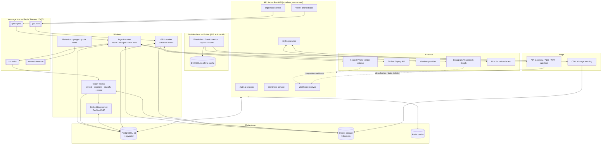
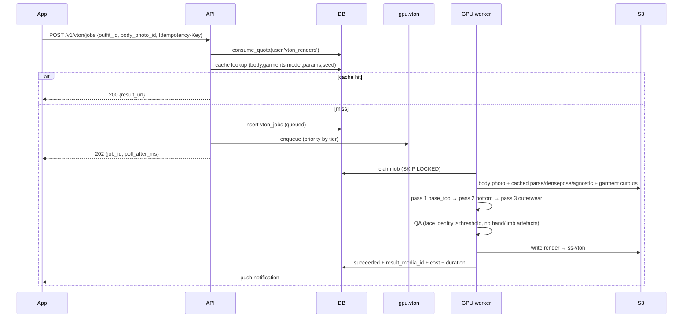

# SmartStylist — System Architecture (Phase 1)

> Status: Phase 1 deliverable. Companion files: `docs/02-data-model.md`,
> `docs/03-api.md`, `api/openapi/openapi.yaml`, `db/migrations/*`, `db/seeds/*`.

---

## 1. Product in one paragraph

SmartStylist builds a **digital twin of the user's real closet** from photos they
already have, then answers one question well: *"what do I wear to X, today?"* —
and shows the answer **on the user's own body** via a virtual try-on render.
Three engines sit behind that: an **ingestion/CV pipeline** (photo → segmented,
classified, colour-profiled garment), a **styling engine** (occasion + weather +
colour theory + personal taste → ranked outfits), and a **VTON engine**
(person image + garment cutouts → photorealistic render).

---

## 2. Constraints that shape the design

These are load-bearing. Each one changed a concrete architectural decision.

| # | Constraint | Architectural consequence |
|---|---|---|
| C1 | **Social platforms no longer expose arbitrary user media.** Instagram's Basic Display API was retired (Dec 2024); the replacement (*Instagram API with Instagram Login* / Facebook Login for Business) covers **professional accounts only**. Facebook `user_photos` needs App Review. TikTok's Display API returns **the authenticated user's own** posts under `video.list`, after app approval. | **Manual/batch upload is the primary ingestion path**, not a fallback. Social connectors are per-provider *plugins* behind one `IngestSource` interface, each independently feature-flagged, and the product must be fully usable with zero connectors enabled. No scraping of third-party or public profiles — it violates platform terms and, in the EU/UK, likely GDPR. |
| C2 | Body measurements, skin tone, face shape and body photos are **special-category / biometric-adjacent data** (GDPR Art. 9, Illinois BIPA, Texas CUBI). | Separate `private` schema, no client-reachable grants, `SECURITY DEFINER` accessors that **check consent and write an audit row on every read/write**, short-lived signed URLs, and a hard-delete path. Consent is per-purpose and versioned. |
| C3 | The strongest open VTON checkpoints (IDM-VTON, OOTDiffusion, CatVTON, Leffa) commonly ship under **non-commercial** licences. | `vton_models.commercial_ok` is a first-class column; the router **cannot** dispatch a non-commercial model to a paying tier. Licence review is a launch gate, not a detail. |
| C4 | Diffusion VTON is **~6-12 s and GPU-bound**; segmentation is ~0.3-1 s. | Everything heavy is **asynchronous**: `202 Accepted` + job id + push/poll. GPU workers scale on a separate queue from CPU workers so a try-on backlog never blocks wardrobe tagging. |
| C5 | A VTON render costs real money (GPU-seconds); a bored user can tap "try on" 50 times. | Per-user monthly quota counters in the DB (`usage_counters`, `consume_quota()`), idempotency keys on every job-creating endpoint, and aggressive result caching keyed on `(body_photo, garment_set, model, params, seed)`. |
| C6 | Mobile clients on flaky networks; images are large. | Direct-to-storage uploads via presigned URLs (the API never proxies bytes), client-side downscale to ≤2048 px, resumable multipart for batches, and an offline-first wardrobe cache. |

---

## 3. Component architecture



### Why these boundaries

* **API tier is stateless and CPU-cheap.** It validates, authorises, enqueues and
  reads. It never runs a model. This keeps p99 latency for the wardrobe screen
  under ~150 ms and lets the tier scale on request count alone.
* **Two worker classes.** CPU workers (ingest, segmentation on ONNX/CPU or a
  small shared GPU, embeddings) and GPU workers (diffusion VTON, L40S/A10G
  class). Separate queues, separate autoscaling signals, separate cost centres.
* **The database is the coordination point,** not the queue. Job rows in
  `ingest_jobs` / `vton_jobs` are the source of truth for status; the queue is
  just a delivery mechanism, so a lost message is recoverable by a reaper that
  re-enqueues rows stuck in `queued`.

---

## 4. Technology decisions

| Layer | Choice | Rationale / rejected alternative |
|---|---|---|
| Mobile | **Flutter 3.x** | One codebase, and the wardrobe grid + try-on comparison slider are custom-drawn UI where Flutter's rendering model wins. React Native is viable if the team is JS-heavy; the API contract is identical either way. |
| State (mobile) | Riverpod + Drift (SQLite) | Offline-first closet browsing; the wardrobe is read far more often than written. |
| Backend | **Python 3.12 + FastAPI**, Pydantic v2, SQLAlchemy 2.0 async, Alembic | Same language as the CV/ML stack — no cross-language serving hop for model code. Node/Express would force a second service just to host PyTorch. |
| Workers | Celery (Redis broker) or arq | Celery for mature routing/retries/beat; arq if the team prefers pure asyncio. |
| DB | **PostgreSQL 16 + pgvector** (Supabase or RDS) | One store for relational data *and* embeddings — no separate vector DB to keep in sync at this scale (<10M garments). Revisit Qdrant/pgvectorscale past ~50M vectors. |
| Object storage | S3 (or Cloudflare R2 for egress-free CDN) | Presigned PUT/GET; lifecycle rules per bucket. |
| Cache | Redis | Weather snapshots, recommendation results (5 min), presigned URL reuse, rate limiting. |
| Auth | Supabase Auth or Auth0 → JWT (RS256) | The DB's RLS policies read `sub` straight from the JWT, so the same policy set protects both PostgREST-style direct access and the FastAPI tier. |
| Infra | Docker + Terraform; ECS/Fargate (API, CPU workers) + GPU node group (EKS/RunPod/Modal) | GPU capacity is the only thing that needs specialised scheduling. |
| Observability | OpenTelemetry → Grafana/Tempo/Loki; Sentry | Trace id propagates from mobile → API → queue → worker → back, so one tap is one trace. |

---

## 5. The three pipelines

### 5.1 Ingestion & computer vision

```mermaid
sequenceDiagram
    participant App
    participant API as FastAPI
    participant S3
    participant Q as Queue
    participant WI as Ingest worker
    participant WV as Vision worker
    participant DB as Postgres

    App->>API: POST /v1/uploads/presign (n files, sha256)
    API->>DB: reserve media_assets rows (dedupe on sha256)
    API-->>App: presigned PUTs + asset ids
    App->>S3: PUT bytes (direct)
    App->>API: POST /v1/ingest/jobs {asset_ids}
    API->>DB: insert ingest_jobs (queued)
    API->>Q: enqueue cpu.ingest
    API-->>App: 202 {job_id}
    WI->>S3: fetch, strip EXIF, normalise, pHash
    WI->>DB: mark downloaded, drop near-duplicates
    WI->>Q: enqueue cpu.vision (per asset)
    WV->>WV: detect+segment → classify → colour → quality gate
    WV->>S3: write RGBA cutouts
    WV->>DB: insert detections; auto-accept high-confidence → garments
    WV->>DB: embeddings (768-d) → garment_embeddings
    WV->>App: push "12 items added, 3 need review"
```

**Model stack (each stage swappable; every inference records `model` + `version`
on the row so results stay reproducible and A/B-comparable):**

| Stage | Primary | Fallback / notes |
|---|---|---|
| Person & garment detection + instance masks | **YOLO-v11-seg** fine-tuned on DeepFashion2 + ModaNet | Mask R-CNN if recall on layered outfits matters more than latency |
| Open-vocabulary rescue for unknown items | **Grounding DINO → SAM 2** | Slower; used only when the detector's top score < 0.45 |
| Flat-lay / catalogue photos | Salient-object segmentation (U²-Net / BiRefNet) | Detector often misfires on ghost-mannequin shots |
| Attribute classification (category, sleeve, neckline, fit, pattern) | **FashionCLIP / Marqo-FashionSigLIP** zero-shot over the taxonomy's `synonyms`, plus a small trained head per attribute | Zero-shot ships day one; the trained head replaces it as labelled data accrues |
| Dominant colour | k-means (k=5) **in CIELAB** on the masked pixels, shadow/highlight pixels trimmed, mapped to `color_families` by nearest anchor under **CIEDE2000** | Implemented in-DB too (`hex_to_lab`, `ciede2000`, `lab_to_lch`) so the engine can score without a round trip |
| Human parsing / pose (VTON prep) | SCHP (ATR) + DensePose + ViTPose | Cached per body photo in `private.body_reference_photos` |
| Video posts (TikTok) | ffmpeg keyframe extraction → sharpness + person-area scoring → best 3 frames | Avoids running the full pipeline on 900 frames |

**Quality gate before a detection becomes a garment:** confidence ≥ 0.60, mask
area ≥ 2 % of frame, occlusion score ≤ 0.4, not a near-duplicate (pHash Hamming
≤ 6 **and** embedding cosine ≥ 0.93 against existing items). Anything failing
lands in a **review queue** the user sweeps in a swipe UI — this is also the
cheapest labelled-data source you will ever get.

### 5.2 Styling & recommendation

Three-stage funnel — cheap SQL first, expensive scoring last:

1. **Retrieve** — `wardrobe_candidates(user, occasion, temp_c, precip)` in SQL.
   Filters on availability (not in laundry, not archived), occasion formality
   band and role/category/pattern bans, a temperature-derived warmth band, season
   overlap, and rain rules (no suede, no non-water-resistant outerwear).
   Typically 400 rows → returned already sorted by recency of wear.
2. **Combine** — build outfits by filling the occasion's `required_roles` +
   `optional_roles`. Beam search over role slots (beam width ~50) rather than a
   cartesian product; layering count is driven by the temperature band.
3. **Score & rerank** — weighted sum, weights multiplied by the occasion's
   `scoring_weights` override:

   | Term | Signal |
   |---|---|
   | `color_harmony` | pairwise `score_color_pair()` across the look, weighted by each garment's colour `ratio`; neutrals cost nothing, two heroes are penalised |
   | `palette_fit` | `palette_affinity` between the user's 12-season palette / undertone and each garment's family |
   | `formality_fit` | distance from the outfit's mean formality to the occasion's band |
   | `weather_fit` | total warmth vs. the temperature band; layerability under high diurnal swing; precip and UV |
   | `pattern_balance` | at most one busy pattern; scale contrast rules |
   | `proportion_fit` | body-shape rules (e.g. high-rise + tucked for pear) — from biometrics, only with consent |
   | `personal_taste` | cosine(outfit embedding, `user_style_embeddings.taste_vector`) |
   | `novelty` | days since each item was worn; penalises the same three shirts |
   | `trend` | cosine against `style_references` for the current season |

   Optional final pass: an LLM reranks the top ~10 and writes the one-line
   rationale ("navy blazer over the camel chinos — high contrast, reads formal
   enough for the 9am, and you haven't worn the blazer in 3 weeks"). The LLM
   **never invents items**; it only orders and explains a fixed candidate list.

Every call writes a `recommendation_runs` row (inputs, engine version, weights,
latency), so any suggestion is replayable and experiments are attributable.
Feedback (`outfit_feedback`) updates the taste vector by EMA.

**Cold start:** a new user with 6 items still gets outfits — the engine falls
back to category priors and colour theory alone, and `style_preferences`
collected at onboarding (archetypes, avoided colours, modesty rules) carry the
weight until ~20 feedback events exist.

### 5.3 Virtual try-on



* **Layering is sequential.** Most VTON checkpoints drape one garment; each pass
  takes the previous render as the person image (`parent_job_id`, `pass_index`).
  Order: base top → bottom → mid layer → outerwear. Shoes and bags are usually
  better **composited** with a warp than diffused.
* **Identity preservation** is non-negotiable: the face region is masked out of
  the diffusion target and re-composited, with a face-embedding similarity check
  in QA. A try-on that changes your face is worse than no try-on.
* **Provider router** picks a model by `commercial_ok` (tier), `supports_roles`,
  latency budget and cost. `mock@1` runs in CI so the whole flow is testable
  without a GPU.
* **Renders expire.** `vton_jobs.expires_at` defaults to 30 days; the
  maintenance worker purges bytes and nulls the media rows.

---

## 6. Storage layout

| Bucket | Contents | Access | Lifecycle |
|---|---|---|---|
| `ss-user-source` | originals (uploads, social pulls) | private, presigned 15 min | IA after 30 d; delete on account deletion |
| `ss-cutouts` | RGBA garment cutouts, masks | private, presigned 1 h | keep while garment exists |
| `ss-body` | body reference photos + parse/densepose caches | private, presigned **5 min**, no CDN | delete on consent withdrawal; TTL configurable |
| `ss-vton` | try-on renders | private, presigned 1 h | 30-day TTL by default |
| `ss-public` | CDN thumbnails, editorial `style_references` | public read | CDN cached |

Key convention: `{user_id}/{yyyy}/{mm}/{asset_id}.{ext}` — user-prefixed so an
erasure request is a single prefix delete, and `media_assets(bucket, storage_key)`
is unique so orphan detection is a trivial anti-join.

---

## 7. Security & privacy

* **Defence in depth on the data plane.** RLS is enabled *and* `FORCE`d on all 22
  owner-scoped tables, with policies keyed on `public.current_user_id()` (JWT
  `sub`, or an `app.current_user_id` GUC set per request transaction on
  self-hosted deployments). Child tables (`garment_colors`, `outfit_items`) are
  scoped through their parent. The API's own connection uses the `authenticated`
  role, **not** the owner — so an SQL-injection bug still can't cross tenants.
  Verified by tests 15-19 in `db/tests/smoke_test.sql`.
* **Biometrics are quarantined.** `private.biometric_profiles` and
  `private.body_reference_photos` have no grants to `authenticated`; access goes
  through `get_biometric_profile()` / `upsert_biometric_profile()`, which check
  consent and append to `audit.access_log`. Recommended addition in production:
  pgsodium/TDE column encryption keyed per environment.
* **Consent is a ledger, not a boolean.** Append-only `user_consents` with a
  policy version; revocation is a new row. `has_consent()` gates every biometric
  and VTON write path. Withdrawing `vton_processing` stops renders and triggers
  deletion of body photos.
* **OAuth tokens never sit in the app schema.** `private.social_credentials`
  stores a *reference* to a secrets manager entry, so a database dump cannot
  impersonate a user on Instagram.
* **Platform obligations are implemented, not promised.** `deletion_requests` +
  the webhook receiver cover Meta's deauthorize and data-deletion callbacks;
  `webhook_events` gives signature verification and idempotency for every
  inbound callback.
* **Content safety.** NSFW/minor detection on every uploaded person image before
  it can be used as a VTON input (`media_assets.moderation_status`) — this is
  the single highest-risk surface in the product. Renders are private by
  default; sharing requires an explicit action and a watermark.
* Standard hygiene: TLS everywhere, EXIF (incl. GPS) stripped on ingest, no PII
  in logs or trace attributes, per-user and per-IP rate limits, signed URLs
  never logged.

---

## 8. Reliability, SLOs and cost

| Path | Target |
|---|---|
| Wardrobe read (p99) | ≤ 200 ms |
| `POST /outfits/recommend` (p95, cached weather) | ≤ 900 ms |
| Segmentation per image (p95) | ≤ 3 s |
| VTON single pass (p95) | ≤ 15 s |
| Job success rate | ≥ 99 % excluding user-input errors |

* **Retries:** exponential backoff, 3 attempts, dead-letter queue; `attempts` is
  on the job row so a poison message is visible in SQL.
* **Reaper:** rows in `queued`/`running` past a TTL are re-enqueued or failed.
* **Back-pressure:** when `gpu.vton` depth exceeds N per GPU, the API returns
  `202` with a longer `poll_after_ms` and a queue-position estimate rather than
  accepting unbounded work.
* **Unit economics (order of magnitude, verify against your own provider):**
  ingest+segment ≈ $0.001-0.005 per image on CPU/shared GPU; a diffusion VTON
  pass ≈ $0.01-0.08 depending on self-hosted vs. hosted. VTON dominates —
  hence quotas, caching, and a free tier measured in renders per month.

---

## 9. Repository layout (monorepo)

```
smartstylist/
├── db/
│   ├── migrations/      0001…0009  (validated on PostgreSQL 16.13 + pgvector 0.6.0)
│   ├── seeds/           taxonomy · occasions · colour theory · VTON registry
│   └── tests/           smoke_test.sql (20 assertions, all passing)
├── api/
│   ├── openapi/         openapi.yaml — the contract both sides build against
│   └── app/             FastAPI service            ← Phase 2
├── workers/
│   ├── ingest/          social connectors, dedupe  ← Phase 2
│   ├── vision/          detect · segment · tag     ← Phase 2
│   ├── styling/         recommendation engine      ← Phase 3
│   └── vton/            GPU pipeline               ← Phase 4
├── mobile/              Flutter app                ← Phase 5
├── infra/               Terraform, Dockerfiles, CI
└── docs/                01-architecture · 02-data-model · 03-api
```

---

## 10. Phase plan

| Phase | Deliverable | Exit criteria |
|---|---|---|
| **1 (done)** | Architecture, schema, API contract | Migrations apply clean; smoke test green; OpenAPI validates |
| 2 | Upload → segmentation → tagged wardrobe | A photo becomes a correctly categorised, colour-profiled garment end to end; ≥ 85 % category accuracy on a held-out set |
| 3 | Styling engine | Occasion + weather + closet → ranked outfits with rationale; offline eval against stylist-labelled looks |
| 4 | VTON pipeline | Try-on render in ≤ 15 s p95, face identity preserved, quota + cache enforced |
| 5 | Flutter app | Onboarding, wardrobe, event selector, outfit detail, try-on screen wired to the live API |

---

## 11. Open decisions to make before Phase 2

1. **Supabase vs. self-hosted Postgres + S3.** Supabase gives auth, storage,
   RLS and pgvector out of the box (fastest to Phase 2); self-hosted gives GPU
   co-location and cheaper egress at scale. The schema runs on both unchanged.
2. **VTON: self-host or vendor.** Self-hosting a non-commercially-licensed
   checkpoint is fine for a demo and a legal problem at launch. Decide before
   building the router's production path.
3. **Which social connector first.** TikTok's own-content endpoint is the most
   permissive; Instagram requires the user to have a professional account.
   Recommendation: ship manual upload + camera roll import first, add exactly
   one connector after CV accuracy is proven.
4. **Detector training data.** DeepFashion2 and ModaNet have their own licence
   terms for commercial use — confirm before fine-tuning on them.
