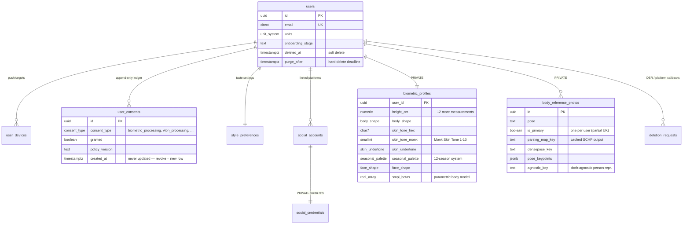
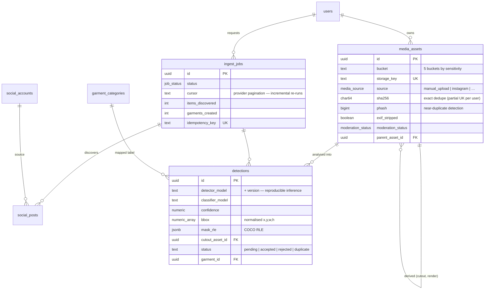
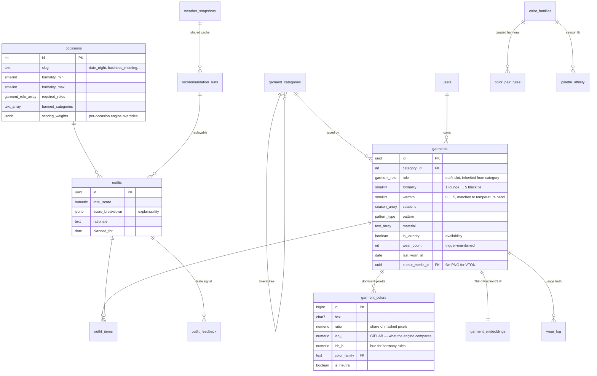
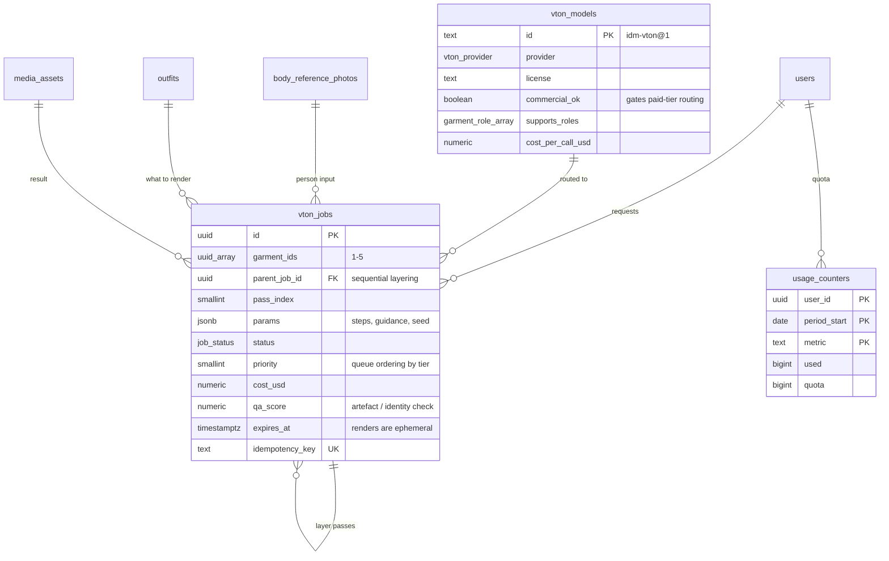

# SmartStylist — Data Model (Phase 1)

35 tables across three schemas, validated on **PostgreSQL 16.13 with pgvector
0.6.0**. Every migration in `db/migrations/` applies cleanly from an empty
database, and `db/tests/smoke_test.sql` exercises the consent gate, category
inheritance, colour maths, candidate filtering, wear-log triggers, quotas and
RLS isolation (20 assertions, all passing).

| Schema | Purpose | Client access |
|---|---|---|
| `public` | application data | RLS-protected, role `authenticated` |
| `private` | biometrics, body photos, OAuth token references | **none** — service role + `SECURITY DEFINER` accessors only |
| `audit` | append-only access trail for special-category data | service role only |

---

## 1. Identity, consent and biometrics

**Design notes**

* `user_consents` is **append-only**. `has_consent(user, type)` reads the latest
  row; `upsert_biometric_profile()` raises `42501` without it (smoke test 1).
* Measurements are stored in **metric only**; `users.units` controls display, so
  no unit ambiguity ever reaches the database.
* `smpl_betas` lets a photo-estimated body model feed both size advice and VTON
  warping later, without changing the schema.
* `social_credentials` holds a **reference** to a secrets-manager entry, not the
  token itself.

---

## 2. Ingestion and computer vision

**Design notes**

* A detection is **not** a wardrobe item. It is model output with provenance;
  promotion to `garments` happens on a confidence gate or a user tap, and the
  link is kept so you can retrain on corrections.
* Model name **and** version on every row: when the detector is upgraded you can
  re-run only the items tagged by the old version.
* Dedupe is two-layer — `sha256` for byte-identical re-uploads, `phash` +
  embedding cosine for the same shirt photographed twice.

---

## 3. Wardrobe, colour and styling

**Design notes**

* **Category priors flow into garments.** Insert a garment with only a category
  and the `BEFORE INSERT` trigger fills `role`, `formality`, `warmth`, `seasons`
  and `is_layerable` from `garment_categories` — the CV pipeline supplies what it
  is confident about and inherits the rest (smoke test 5).
* **Colour lives in CIELAB, not hex.** `lab_*` for perceptual distance
  (CIEDE2000), `lch_h` for harmony geometry, `color_family` for the curated rule
  table. `hex_to_lab()`, `lab_to_lch()` and `ciede2000()` are implemented in SQL
  and validated against Sharma et al.'s reference pairs — all five match to four
  decimals.
* **Occasion rules are data, not code.** Adding "Eid gathering" or "gallery
  opening" is an INSERT, not a deploy.
* `outfit_items` has a partial unique index enforcing single-occupancy roles —
  one pair of trousers, many rings (smoke test 11).
* `wear_log` triggers keep `wear_count` / `last_worn_at` correct on insert *and*
  delete, which the novelty term and cost-per-wear analytics depend on.

---

## 4. Virtual try-on and metering

`consume_quota()` does the check-and-increment in one `SELECT … FOR UPDATE`
transaction, so parallel taps can't overshoot the limit (smoke test 14).

---

## 5. Functions the application layer calls

| Function | Purpose |
|---|---|
| `current_user_id()` | JWT `sub` or `app.current_user_id` GUC — the basis of every RLS policy |
| `has_consent(user, type)` | consent gate |
| `get_biometric_profile()` / `upsert_biometric_profile(jsonb)` | the only sanctioned path into `private.biometric_profiles`; audited |
| `hex_to_lab(hex)` / `lab_to_lch(a,b)` / `hex_to_color_row(hex)` | colour conversion (hue normalised to `[0,360)`) |
| `ciede2000(l1,a1,b1,l2,a2,b2)` | perceptual colour difference |
| `score_color_pair(a, b, …)` | curated rule → neutral rule → hue geometry fallback |
| `wardrobe_candidates(user, occasion, temp_c, precip, roles, limit)` | stage-1 retrieval for the styling engine |
| `consume_quota(user, metric, n)` | atomic quota check-and-increment |
| `category_descendants(slug)` | recursive taxonomy expansion |

## 6. Views

`v_user_consent_state` · `v_garment_primary_color` · `v_wardrobe_stats`
(items, never-worn count, worn in last 30 days, average cost-per-wear, closet value)

---

## 7. Seed data shipped

| Seed | Rows |
|---|---|
| Garment taxonomy | 71 categories (7 supercategories, 45 categories, 19 subcategories) with synonyms for detector-label mapping |
| Occasions | 15, incl. Date Night, Business Meeting, Job Interview, Formal Event, Wedding Guest, Religious Service, Funeral, Workout, Travel Day |
| Colour families | 29 with LCh bounds and warm/cool classification |
| Curated colour pairings | 34 (navy+camel 0.95, black+white 0.92, red+green 0.25 …) |
| Palette affinity | 39 rows across the four core seasonal palettes |
| VTON model registry | 5 entries incl. a deterministic `mock@1` for CI |
